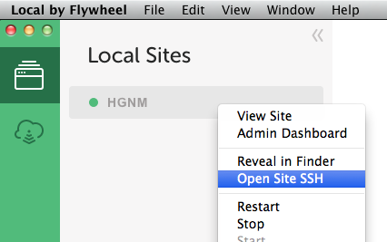

# hgnm-wp-dev

This is a bootstrapping script for use with [Local][e6c53d4d] to help you get set up with a local WordPress install and work on the [`hgnm-2014`](https://github.com/HGNM/hgnm-2014) theme.

  [e6c53d4d]: https://local.getflywheel.com/ "Local"


## 1. Install & set-up Local

We are going to use [Local by Flywheel][e6c53d4d], a free desktop app that allows you to run local WordPress instances.

  1. **[Download Local for macOS →](https://local-by-flywheel-flywheel.netdna-ssl.com/releases/2-2-4/local-by-flywheel-2-2-4-mac.zip)**

  2. Once the download has finished, run the installer and open Local
  
  3. Create a new site using the dialog displayed or **File** > **Add New Site** (<kbd>⌘ N</kbd>)

    The settings are not very important, but for the rest of this guide we will assume you enter `hgnm` as the site name
    
  4. Click through as Local sets up your site, making a note of the username and password you enter in the “Setup WordPress” panel

## 2. Configure the site for `hgnm-2014` development

  1. Right-click on your site in Local and select **Open Site SSH**

    
    
  2. A Terminal window will open, run the following commands:

    ```sh
    # install Git in Local’s virtual machine
    apt-get install git
    # download this repository to the virtual machine
    git clone https://github.com/HGNM/hgnm-wp-dev.git
    # run the bootstrapping script
    ./hgnm-wp-dev/run
    ```

The bootstrap script will install & activate required WordPress plugins, populate WordPress with real content from [hgnm.org](http://hgnm.org), and install & activate the `hgnm-2014` WordPress theme as a development repository.


## 4. Enjoy!

At this point a default WP install is available at <http://hgnm.local/> (unless you chose a different local address in step 1).

Head over to [the `hgnm-2014` repo](https://github.com/HGNM/hgnm-2014#set-up) for notes on how to develop the theme.
